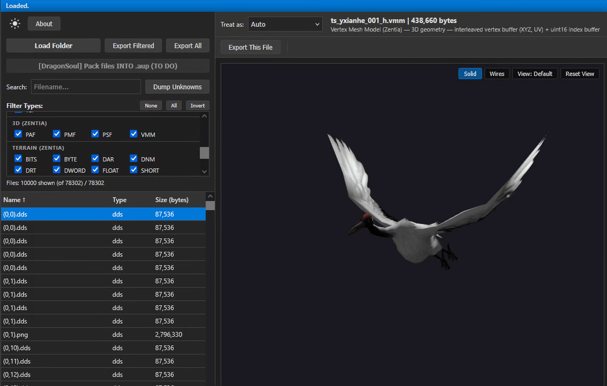

# Zentia / Xunxian /《寻仙》MMORPG - Fan Preservation Project

> [!IMPORTANT]
> **File help request!**  
>
> Any and all Zentia/Xunxian-related files can be incredibly important to the proper preservation of this game, especially any files for the game versions below 3.X.X.X.  
> In case you or someone you know played this game long ago (especially in 2008-2012), please search that PC, any old devices, laptops, file backups, and old USB drives for each of these keywords: Zentia, Xunxian, ManualPatch, 寻仙  
> And contact me in case you find **anything** at: luka.celebic12 AT gmail.com 

## Table of Contents

- [Game summary](#games-summary)
- [Purpose](#purpose)
- [My background](#my-background)
- [Current progress](#current-progress)
  - [Archiving](#archiving)
    - [Archiving Zentia (2010-2012)](#archiving-zentia-2010-2012)
    - [Archiving Xunxian (2008-Today)](#archiving-xunxian-2008-today)
    - [Archived versions of other games from the same developer](#archived-versions-of-other-games-from-the-same-developer)
  - [Reverse engineering](#reverse-engineering)
    - [Some of the more important completed tasks](#some-of-the-more-important-completed-tasks)
    - [Reverse engineering game asset packing format: `whpackage1.0` / `whsc1.0` / .dpk](#reverse-engineering-game-asset-packing-format-whpackage10--whsc10--dpk)
- [Publishing all of the files and the actual reverse-engineering work](#publishing-all-of-the-files-and-the-actual-reverse-engineering-work)
- [Want to help?](#want-to-help)

## Game summary:

- **《寻仙》(Xunxian)** (Also called《新寻仙》(New Xunxian) [since 18-Dec-2012](https://baike.baidu.com/item/%E6%96%B0%E5%AF%BB%E4%BB%99/1634935))  
PC MMORPG  
Official site: [xx.qq.com](https://xx.qq.com/)  
Servers online: [27-Oct-2008](https://www.pixelgame.net/pixelsoft/site/xunxian) to present  
[Released in](https://www.pixelgame.net/pixelsoft/english/xunxian): Mainland China / Hong Kong, China / Taiwan, China / South Korea / Singapore / Malaysia / Thailand / Europe / Vietnam / North America  

- **Zentia** (Global EU/USA release of 《寻仙》 with minor differences, initially codenamed "Project Z")  
PC MMORPG, collaboration with [wikipedia.org/wiki/ChangYou.com](https://en.wikipedia.org/wiki/Changyou.com)  
Official site: z.us.changyou.com, zentiathegame.com  
Servers online: [Closed Beta Test start 14-Jul-2010](https://web.archive.org/web/20101126235327/http://z.us.changyou.com/news/archive.php) to [shutdown 13-Aug-2012 11:59PM PDT](https://web.archive.org/web/20260302051524/https://mmohuts.com/news/changyou-shutting-down-zentia)  

- **《寻仙》** (Mobile version of the PC game of the same name with [some differences](https://www.pixelgame.net/pixelsoft/english/xunxiansy): "simplify the processes to make it more suitable for the growth rhythm of mobile games. At the same time, it would deepen pet-related gameplay and strengthen the interaction between players.")  
Servers online: [1-Aug-2017](https://www.pixelgame.net/pixelsoft/english/xunxiansy) to present  
[iOS](https://apps.apple.com/cn/app/%E5%AF%BB%E4%BB%99/id1186647303) and Android MMORPG

## Purpose:
The end goal of this fan project is preserving everything Xunxian-related for the sake of gaming, artistic, and cultural history, but also for research and educational purposes.

## My background:
I played and enjoyed Zentia early on when it came out in 2010 for a few hundred hours on a free-to-play account only, and now I want to work to preserve and reverse-engineer that game so that everyone else can one day also have that experience instead of it being lost forever.  

I have worked on searching for, researching, and reverse-engineering Zentia/Xunxian-related files on and off, little by little when I had the time, for multiple years, mostly since 2023, but there are still a lot of files left to be found and archived, and even more things to be reverse-engineered.

# Current progress:

# Archiving

I have previously uploaded most of my files to [this Internet Archive page](https://archive.org/details/Xunxian-Zentia-MMORPG-Client-v7-0-26-1). However, constantly updating the page is very tedious since the site can be very fragile when updating items, so I won't bother with doing that right now. I will dump all of my files there again at some later point.  
That page already has the most important Zentia files anyway.

This document itself will be the most up-to-date resource that lists which files I've archived.  

---

### Archiving Zentia (2010-2012):

**Full clients** (1.1.28.2 to 1.4.25.27 existed, not including the [press release version](https://web.archive.org/web/20101126235327/http://z.us.changyou.com/news/archive.php) which may have been 1.1.28.1):  
**Have:** 1.1.28.2 1.1.28.5 1.1.29.4 1.2.25.4  
**Important missing:** 1.3.X.X, 1.4.X.X

**ManualPatch files** ([47 existed](https://web.archive.org/web/20120718224402/http://z.us.changyou.com/download/manual.shtml) in total. File name format: `ManualPatch<fromGameVersion>-<toGameVersion>.exe`. These contain whole game asset files that were updated from one version to the other inside.):  
**Have:** (11 + 1 partial): 1.1.28.5-1.1.28.6 1.1.28.6-1.1.28.7-(partial) 1.1.29.19-1.1.29.21 1.3.66.10-1.3.66.11 1.3.66.11-1.3.66.12 1.4.25.16-1.4.25.17 1.4.25.17-1.4.25.18 1.4.25.18-1.4.25.19 1.4.25.19-1.4.25.20 1.4.25.21-1.4.25.22 1.4.25.26-1.4.25.27  
**Important missing:** The rest from the linked 47 above. I think a few were probably uploaded to VirusTotal.com that can be downloaded, but an expensive enterprise account is needed to use the Advanced Search to find and download them.  

---

### Archiving Xunxian (2008-Today):

**Full clients** (0.8105.X? to 8.X.X.X+ exist):  
**Have:** 3.0.4.1 3.0.21.1 3.1.3.1 3.2.4.1 3.3.4.1 3.3.21.1 3.4.3.1 3.4.23.1 3.5.42.1 3.5.6.1 3.5.63.1 3.6.4.1 3.6.42.1 3.7.2.1 3.8.5.1 3.8.14.1 3.8.41.1 3.9.3.1 3.9.22.1 4.1.2.1 4.2.0.1 4.2.2.1 4.3.2.1 7.0.26.1 8.0.3.1 8.1.1.1 8.2.0.1 8.2.3.1  
**Important missing:** All before 3.X.X.X, especially clients around versions ~0.8105.X ~0.8306.X and before  

**ManualPatch files:**  
**Have:** A lot after ManualPatch2.3.23.1-2.3.24.1.exe  
**Important missing:** From 2.1.25.1 to 2.3.23.1, from 2.0.25.1 to 2.0.26.1, all before ManualPatch1.0.46.1-1.1.4.1.exe  

**Server files:**  
**Have:** "寻仙手工端+寻仙之路+寻仙马端源码" - The widespread **incomplete** official Malaysian server-side compiled binaries with a lot of symbols leak. Probably for the game version 3.5.66.1. It has a lot of important server-side binaries, but it's also missing important binaries for login, some database logic, and other important things. It's not something that can be quickly patched to make the game work. I have multiple versions of the repack releases of these files, but they all seem to be mostly the same.  
**Important missing:** The actual full Malaysian server leak, and any other server files.  

**Private server clients:**  
**Have:** 95版本客户端, 104服客户端, 105版本客户端, 120仙途OL, 仙路有你  

---

### Archived versions of other games from the same developer:

Archiving for preservation purposes, but also because most of these games should be using the same custom engine, custom asset formats, and general game architecture, which could help in better understanding Zentia/Xunxian itself.  

<small>I can't spend the huge amount of time scouring the internet for these game versions as I did for Zentia/Xunxian right now. But do contact me if you have more or missing games.</small>

**Xunxian (mobile game)** (Very similar game but for mobile, uses Unity instead of the in-house game engine and uses a different, uniquely custom encrypted, custom asset packing format with the custom container: `.pkg` (`PPkg1.0` / `50 50 6B 67 31 2E 30 00`), which I cracked and wrote an unpacker script for.)  
**Have:** 18.5.0 20.2.0 21.2.0 24.1.0 25.1.0 26.2.0 27.3.0 27.3.109

**Blade & Sword 2 (刀剑2)** (Same in-house game engine and its custom asset formats as Xunxian. Initial versions used a slightly different than usual .dpk/whpackage1.0 asset packing container format and unique custom asset encryption, while later versions used a different unique asset container format `.spk` (`spkm1.0` / `73 70 6B 6D 31 2E 30 00`) and unique custom encryption, I cracked the encryption and wrote an unpacker script for the first versions, while the newer versions already had closed-source unpacking tools made for it which I also have.)  
**Have:** 1.0.0.1 (Closed beta test), 4.6.0.001_0? and 45 ManualPatch files ([still available](https://d2.qq.com/down.shtml)), Taiwan server leaked files along with the corresponding client

**《勇者大冒险》手游** (Adventure of the Brave Mobile) (Same in-house game engine and its custom asset formats as Xunxian.)  
**Have:** 1.4.10 1.5.1 1.6.4

**《勇者大冒险》端游** (Adventure of the Brave PC) (Global version published on Steam as "[Global Adventures](https://store.steampowered.com/app/565020/Global_Adventures/)") (Same in-house game engine and its custom asset formats as Xunxian.)  
**Have:** 1.3.41.1 (last Steam version for the global release "Global Adventures")

**《妄想山海》(Wangxiang Shanhai / Fancy World / Chimeraland)** (PC and mobile versions), [shanhai.qq.com](https://shanhai.qq.com/), [Steam](https://store.steampowered.com/app/1913730/Chimeraland/), [22-Jul-2020](https://www.pixelgame.net/pixelsoft/english/wangxiang) to today? (Global version "Chimeraland" shut down on [30-Mar-2024](https://mmos.com/news/chimeraland-shutting-down-on-march-30)), (Uses a different, uniquely custom encrypted, custom asset packing format with the custom container: `.dpk` (`PPkg1.0` / `50 50 6B 67 31 2E 30 00`), which I cracked and wrote an unpacker script for.)  
**Have:** PC: 2.3.1.25 (last version published [on Steam](https://store.steampowered.com/app/1913730/Chimeraland/), 15-Dec-2023), Chinese mobile versions: 2.0.5 2.0.6 2.0.7 2.0.9 2.0.10 2.0.11 2.0.12, Global mobile versions: 1.0.5 1.0.7 1.0.8 2.0.2 2.2.1 2.3.1  

# Reverse engineering

I have learned a lot about the game, prepared and reverse-engineered important parts around the game that will make a lot of later work a lot easier, but there is still a lot to do and currently, the game is still not playable and the next big step is still cracking the client network packet encryption, which, like most other things around reverse-engineering this game, doesn't seem too easy.

### Some of the more important completed tasks:
- Reverse-engineered the very complex custom game asset `.dpk` archive package `whpackage1.0` format and its v1 multi-stage custom encryption. Wrote a decryptor/unpacker for it.
- Reverse-engineered most of the custom game asset formats, including the more complex 3D asset formats: `.vmm` (`20 00 00 00 56 4D 4D 00`), `.pmf` (`1C 00 00 00 50 4D 46 00`), `.short`. Wrote a 3D viewer for them.
- Have access to the, now very easily readable, GUI logic for the entire game
- Set up the game to have arbitrary code execution from within the GUI environment
- Set up the game to utilize only the unpacked game assets (with watching for dynamic changes)
- Mapped all Login and Character Select opcodes  
 

  

## Reverse engineering game asset packing format: `whpackage1.0` / `whsc1.0` / .dpk

Magic bytes `whpackage1.0`: `77 68 70 61 63 6B 61 67 65 31 2E 30`  
Magic bytes `whsc1.0`: `77 68 73 63 31 2E 30`  

Files with the `.dpk` extension that start with the ASCII magic bytes `whpackage1.0` (main header) / `whsc1.0` (chunk header) are a very complex, custom, proprietary game asset packing archive file format custom container that uses compression and custom encryption. It seems to have been used since some time before 2008 to the present day only by the Chinese game development company "[Pixel Soft](https://www.pixelgame.net)".

It took weeks of active work, dozens of angles of attack, multiple brute-force and analysis scripts, and thousands of assembly lines to be read from both static and dynamic analysis of the client, ManualPatch, and leaked server binary files, but I have managed to reverse-engineer the first version of this format, which was used since the game's release in 2008 until late 2015/early 2016, when the encryption was silently changed somewhere between the versions 3.9.57.1-3.9.73.1. This means I can unpack older Xunxian's and all of Zentia's assets.  

I then went on to crack the custom encryptions of other asset packing archive formats of other related games for game preservation sake, for education, but also for the challenge and fun of it too. They all use vastly different and mostly custom encryptions and tricks but it took me around a day's work to reverse-engineer and write a decryptor/unpacker for each of them.  
Not having to reverse-engineer the container format itself again, even though that's the easiest part, and by now knowing the "mind" of the developers and what they will probably do along with some experience and the fact that Zentia's custom multi-stage encryption was much more complex is what allowed me to crack those other encryptions much faster.  

### Games that use the `whpackage1.0` format:

- **《寻仙》(Xunxian)** (Also called《新寻仙》(New Xunxian) [since 18-Dec-2012](https://baike.baidu.com/item/%E6%96%B0%E5%AF%BB%E4%BB%99/1634935))  
PC MMORPG  
Official site: [xx.qq.com](https://xx.qq.com/)  
Servers online: [27-Oct-2008](https://www.pixelgame.net/pixelsoft/site/xunxian) to present  
[Released in](https://www.pixelgame.net/pixelsoft/english/xunxian): Mainland China / Hong Kong, China / Taiwan, China / South Korea / Singapore / Malaysia / Thailand / Europe / Vietnam / North America  
**Format status: Cracked the v1 encryption used for all game versions until the patch 3.9.57.1-3.9.73.1.** Didn't crack the v2 encryption used after but I know how to do so, I just don't care to commit the time to it as I just care about the very old version of the game from 2010-2012 which only uses the v1 encryption.  

- **Zentia** (Global EU/USA release of 《寻仙》 with minor differences, initially codenamed "Project Z")  
PC MMORPG, collaboration with [wikipedia.org/wiki/ChangYou.com](https://en.wikipedia.org/wiki/Changyou.com)  
Official site: z.us.changyou.com, zentiathegame.com  
Servers online: [Closed Beta Test start 14-Jul-2010](https://web.archive.org/web/20101126235327/http://z.us.changyou.com/news/archive.php) to [shutdown 13-Aug-2012 11:59PM PDT](https://web.archive.org/web/20260302051524/https://mmohuts.com/news/changyou-shutting-down-zentia)  
**Format status: Cracked.**

- **《勇者大冒险》端游** (Adventure of the Brave PC) (Global version published on Steam as "[Global Adventures](https://store.steampowered.com/app/565020/Global_Adventures/)")  
PC MMORPG  
Official site: mx.qq.com, [Steam](https://store.steampowered.com/app/565020/Global_Adventures/)  
Servers online: 2014 to Unknown when it shut down (Global version [29-Dec-2017 to ~16-Feb-2018](https://store.steampowered.com/app/565020/Global_Adventures/))  
**Format status: Cracked.** This game packs assets into the same `whpackage1.0` structured proprietary format, but it uses its own completely different custom encryption that is different than even the one from the mobile version of the game.  

- **《勇者大冒险》手游** (Adventure of the Brave Mobile), [mxm.qq.com](https://web.archive.org/web/20200308004836/https://mxm.qq.com/)  
Mobile MMORPG  
Servers online: [26-Mar-2015](https://www.yoyou.com/shipin/201503/2619719.html) to [10-Oct-2019](https://imotao.com/743.html)  
**Format status: Cracked.** This game packs assets into the same `whpackage1.0` structured proprietary format, but it uses its own completely different custom encryption that is different than even the one from the PC version of the game.  

# Publishing all of the files and the actual reverse-engineering work:

I have freely shared my work in some small circles online already and plan to at some point, in the more distant future, publish all of my reverse-engineering work and some special archiving work that was done, all as open source for free one day. However:  
1. The actual, main (Chinese) version of the game is still alive and well, and I don't want to step on any toes of anyone who actually created this good game by publishing files and tools that may aid someone in more easily modding the official game or cheating in it.  
2. Unfortunately, the private server and reverse-engineering scene around this game in China seems to be heavily centered around earning money from the end-users or selling of the files. Given that my work is not complete, releasing any reverse-engineering tools right now would probably mostly just aid those types of people and may help them in earning more money in their closed ecosystems, which I don't want. I want what's best for both the end-users and the company that made the original product.  
3. Publishing any reverse-engineering or special archiving work now could make the official game developers change how those systems work, which could easily make it much harder or impossible from that point onwards to actually preserve certain parts of the game for the sake of video game history.  

In case you are preserving another old but dead game that is utilizing any of the custom and complex game asset packing formats listed here that I have cracked, you can contact me and I may try to unpack/crack those asset files for you. Or, in case you have any other questions or comments, feel free to contact me at: luka.celebic12 AT gmail.com 

# Want to help?

Since I can't know if the many people who are now messaging me about Xunxian are actual true fans of the game that just want to help preserve it or private server owners who want to profit off of my tools, I can't easily share my reverse-engineering work with just anyone.

So for anyone that wants to help as just a genuine fan of the game, they can:

- Help archive the game by locating old (2008-2012) client versions or patches of the game for any version **below** 3.X.X.X.  

    - You can do so by searching all over the internet for it, gaming communities, forums, file hosting websites, reverse-engineering websites, all peer-to-peer networks etc. Especially in China. Especially any old P2P networks in China where these files were likely to have been shared in 2008-2012.  
    Post requests for help in locating these files in those communities online and link back to this GitHub page.  

    - Since the game was [released in](https://www.pixelgame.net/pixelsoft/english/xunxian): Mainland China / Hong Kong, China / Taiwan, China / South Korea / Singapore / Malaysia / Thailand / Europe / Vietnam / North America  
    Try to find clients that were specific to some of these other regions, since some of the game clients were translated in other languages and published by separate game publishers on separate websites hosting the game files.  
    For example in Korea, Xunxian had a separate client, was published by "CJ Internet" and was called "심선 온라인" (Simseon Online). You can search and ask around in Korean gaming communities like section.cafe.naver.com/ca-fe, Korean gaming magazine CD preservation groups etc.  

    - There are also some Chinese (and Korean) old CD preservation groups that digitize and upload old CDs that were distributed in some Chinese magazines and places like that which contained many files on them including game clients since back in those days the internet was much slower and less stable for downloading large game client installers in the browser.  
    Find and properly search through these collections for any discs between 2008-2012, especially 2008/2009.  

    - The biggest help (aside from the game source code itself leaking or there being an entirely new server-side file leak) would be to just find the **complete** Malaysian server-side files leak.  
    Although from what I understand that is being monopolized by private server owners in China and won't be shared.  
    The server-side files that are shared/sold online seem to all be incomplete, or at best look like they are complete inside a compressed .zip archive when looking at it with WinRAR/7-zip, but the data inside the archive is actually still incomplete, since when looking at the **raw data** of the .zip archive through a hex editor you see that some of the data inside was zeroed out manually only **after** actually being compressed, leading to the archive viewers to still display correct metadata as if all the files were there, but no longer have the actual data of some files at all.  

- If you know how to reverse-engineer, you can help by:  

  1. Cracking the client-side network packet encryption.  

  2. Reverse-engineering any other part of the game client or leaked incomplete Malaysian server-side files you want and sending your work.  

  3. Unpacking/dumping all of the packed game .exe and .dll files, which are packed with Tencent Protect (TenProtect/Anti-Cheat Expert/Tersafe/TP3), so that I can decompile and reverse-engineer those newer files later when needed too.  
---

<small>*Information mentioned in this project might not be fully correct.*</small>  
<small>*This is an unofficial fan educational research project not affiliated with any company or official developers. All assets and intellectual property belong to their respective owners.*</small>
